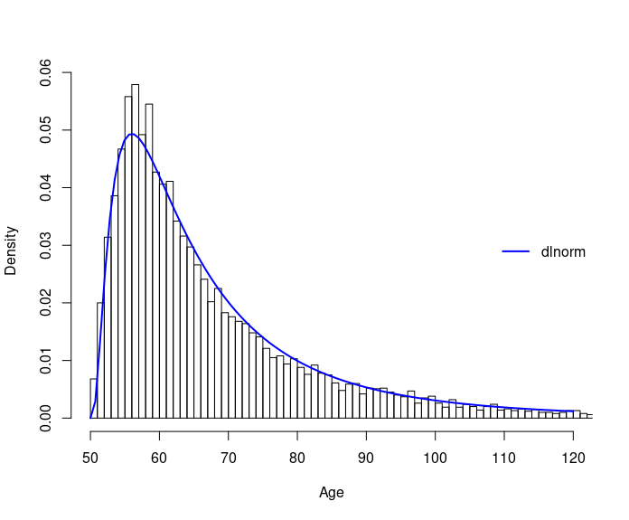

### CladeAge: Empirical Priors of Clade Age Using the Fossil Record
---------------
Santiago Claramunt

Department of Natural History, Royal Ontario Museum, and
Department of Ecology and Evolutionary Biology, University of Toronto, Ontario, Canada.

E-mail: sclaramunt@rom.on.ca


An example simulation using the Solow (2003) method incorporating fossil age uncertainty.

### Overview
---------------
Given a set of fossil ages for a specific clade, these functions model the
uncertainty about the crown age of the clade. The basic method is based on the
model of Strauss & Sadler (1989) and assumes a uniform distribution of precisely
known fossil ages but there are options for incorporating fossil age
uncertainty (Claramunt & Cracraft, 2015) and non-uniform fossil age
distributions (Solow, 2003). The original version of this code aimed at
generating probability density functions, but the current version instead
implements a more efficient strategy involving the generation of random samples
of possible clade ages using quantile functions. These numbers can then be used
to generate a histogram and fit probability functions for using as priors in
Bayesian time tree estimation (Claramunt & Cracraft, 2015).

### Installation
---------------
```
install.packages("devtools");
devtools::install_github("/cladeage", dependencies=TRUE);
```
### References
---------------
Claramunt S, Cracraft J. 2015. A new time tree reveals Earth history’s imprint
on the evolution of modern birds. Science Advances, 1(11), e1501005. doi:
10.1126/sciadv.1501005.

Gingerich PD, Uhen MD. 1998. Likelihood estimation of the time of origin of
Cetacea and the time of divergence of Cetacea and Artiodactyla. Palaeontologia
Electronica, 1(2), 47.

Norris RW, Strope CL, McCandlish DM, Stoltzfus A. 2015. Bayesian priors for tree
calibration: Evaluating two new approaches based on fossil intervals.
bioRxiv, 014340. doi: 10.1101/014340.

Solow AR. 2003. Estimation of stratigraphic ranges when fossil finds are not
randomly distributed. Paleobiology, 29(2), 181–185. doi:
10.1666/0094-8373(2003)029<0181:EOSRWF>2.0.CO;2.

Strauss D, Sadler PM. 1989. Classical confidence intervals and Bayesian
probability estimates for ends of local taxon ranges. Mathematical Geology,
21(4), 411–427. doi: 10.1007/BF00897326.

Wang SC, Everson PJ. 2007. Confidence intervals for pulsed mass extinction
events. Paleobiology, 33(2), 324–336. doi: 10.1666/06056.1.

Wang SC, Chudzicki DJ, Everson PJ. 2009. Optimal estimators of the position
of a mass extinction when recovery potential is uniform. Paleobiology, 35(3),
447–459. doi: 10.1666/0094-8373-35.3.447.

Wang SC. 2010. Principles of statistical inference: likelihood and the
Bayesian paradigm. The Paleontological Society Papers, 16, 1–18. doi:
10.1017/S1089332600001790.
